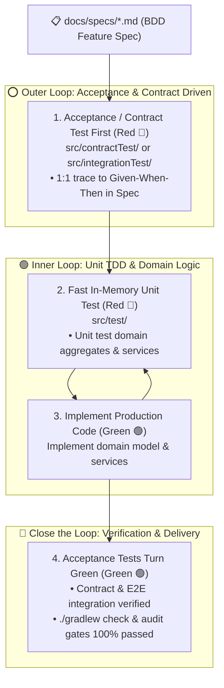

<div align="center">

# 🧠 Doc System Maintainer

**AI-Native Documentation Lifecycle & Hierarchical Context Engineering Manager**

[](LICENSE)
[](https://github.com/langchain-ai/open-swe)
[](references/methodology_guide.md)
[](scripts/audit_doc_health.py)

[English](README.md) | [中文说明](README_zh.md)

</div>

---

## 🌟 Overview

In the era of **Agentic Coding**, AI coding speed has increased tenfold. However, software projects face escalating risks of **documentation rot, architectural erosion, and prompt context drift**.

Traditional documentation is written by humans for humans. **Doc System Maintainer** is an autonomous agent skill that implements **Open-SWE Hierarchical Context Engineering**, **Spec-First Development**, and **Double-Loop ATDD** to automatically bootstrap, maintain, and audit a self-healing 6-artifact documentation system and physical CI/Git gates.

```
your-project/
├── .github/workflows/ci.yml                   # 🛡️ CI Physical Gate (Blocks unaligned PRs)
├── .pre-commit-config.yaml                    # 🛡️ Git Pre-commit Local Gate
├── AGENTS.md                                  # 1. 🌐 Root Rules (Global stack, commands, red lines)
├── app/src/
│   ├── main/.../domain/AGENTS.md              # 🎯 Scoped Domain Rules (Pure POJO, no framework annotations)
│   ├── main/.../adapter/web/AGENTS.md         # 🎯 Scoped Web Rules (DTO isolation, RFC 7807 exceptions)
│   ├── main/.../adapter/persistence/AGENTS.md # 🎯 Scoped Persistence Rules (JPA & Mapper isolation)
│   ├── test/AGENTS.md                         # 🧪 Unit Test Rules (AssertJ, pure in-memory, no Spring Boot)
│   ├── contractTest/AGENTS.md                 # 🧪 Contract Test Rules (Groovy DSL, CDC Spec alignment)
│   └── integrationTest/AGENTS.md              # 🧪 Integration Test Rules (MockMvc, in-memory DB isolation)
├── docs/
│   ├── specs/                                 # 2. 📋 BDD Feature Specifications (Given-When-Then)
│   ├── architecture.md                        # 3. 🏛️ Architectural Topology & Dependency Flow
│   ├── adr/                                   # 3. 🏛️ Architecture Decision Records (ADRs)
│   ├── domain-glossary.md                     # 4. 📖 Ubiquitous Language & Model Topology Tree
│   ├── tasks/                                 # 5. 📝 Task Breakdown & Implementation Checklists
│   └── runbook.md                             # 6. 🚀 Operational Runbook & Smoke Test Scripts
└── scripts/
    └── audit_doc_health.py                    # ⚡ JIT-Generated Zero-Dependency Physical Gate
```

---

## 💡 The 4 Golden Laws of AI Context Engineering

1. **"Same PR Principle"**: Code changes, tests, and associated Specs/ADRs/Glossary must be synchronized in the same commit.
2. **"Open-SWE Precedence Hierarchy"**: 
   $$\text{Scoped/Test AGENTS.md} \succ \text{Root AGENTS.md} \succ \text{docs/specs/*.md} \succ \text{Default LLM Biases}$$
3. **"Token Budget Control (Keep Rules Lean)"**: Root `AGENTS.md` $\le 100$ lines, Scoped `AGENTS.md` $\le 50$ lines. Detailed business logic is offloaded to `docs/specs/`.
4. **"Docs as External Memory"**: Subtask checklists in `docs/tasks/` allow seamless agent handoffs and breakpoint resumption.

---

## 🔄 Double-Loop ATDD Workflow



---

## 🚀 Quickstart & Skill Integration

### 1. In Google Antigravity / Cursor / Claude Code / Open-SWE
Install the skill into your workspace skills directory or clone the repository:

```bash
git clone https://github.com/DRX-1877/doc-system-maintainer-skill.git doc-system-maintainer
```

### 2. Available Modes & Usage

Simply invoke the agent in natural language:

- **Bootstrap a Project (`mode: init`)**:
  > *"Please use doc-system-maintainer to bootstrap the documentation system for this repository."*
  - Automatically recognizes architecture (DDD Hexagonal, MVC 3-tier, FastAPI, Go Clean).
  - Generates Root & Scoped `AGENTS.md` and test suite rules.
  - JIT-compiles `scripts/audit_doc_health.py`.

- **Feature Development (`mode: feature`)**:
  > *"Implement feature: User coupon discount calculation based on doc-system-maintainer ATDD workflow."*
  - Drafts BDD Spec $\rightarrow$ Pauses for human confirmation $\rightarrow$ Outer loop contract test (Red 🔴) $\rightarrow$ Inner loop unit TDD (Green 🟢) $\rightarrow$ Synchronized PR.

- **Health Audit (`mode: audit`)**:
  > *"Run doc-system-maintainer audit to verify doc health and Token budget."*

---

## 🛡️ Physical Audit Gates & CI Enforcement

The generated `scripts/audit_doc_health.py` runs in pure Python 3 standard library with zero third-party dependencies:

```bash
# Run strict gate (Exit code != 0 on missing specs, unregistered models, or token budget overflow)
python3 scripts/audit_doc_health.py --strict
```

### CI / Pre-commit Configurations

#### 1. Git Pre-commit Hook (`.pre-commit-config.yaml`)
```yaml
repos:
  - repo: local
    hooks:
      - id: audit-doc-health
        name: Audit Doc System Health
        entry: python3 scripts/audit_doc_health.py --strict
        language: system
        pass_filenames: false
```

#### 2. Gradle Integration (`build.gradle.kts`)
```kotlin
tasks.register<Exec>("auditDocs") {
    group = "verification"
    description = "Audit documentation alignment and health gates"
    commandLine("python3", "scripts/audit_doc_health.py", "--strict")
}

tasks.named("check") {
    dependsOn(tasks.named("auditDocs"))
}
```

#### 3. GitHub Actions (`.github/workflows/ci.yml`)
```yaml
- name: Run Doc Health Audit Gate
  run: python3 scripts/audit_doc_health.py --strict
```

---

## 📦 Skill Repository Structure

```
doc-system-maintainer/
├── SKILL.md                          # 🧠 Brain center: YAML frontmatter + Adaptive SOP
├── templates/                        # 📐 Standardized Meta-Specs & Templates
│   ├── agents.root.md.tpl            #     - Root Open-SWE rule template
│   ├── agents.scoped.md.tpl          #     - Scoped business layer rule template
│   ├── agents.test.md.tpl            #     - Dedicated test suite rule template (ATDD)
│   ├── audit_script_spec.md          #     - JIT audit script meta-spec
│   ├── spec.md.tpl                   #     - BDD (Given-When-Then) specification template
│   ├── adr.md.tpl                    #     - Architecture Decision Record template
│   ├── domain-glossary.md.tpl        #     - Business models & topology tree template
│   ├── task.md.tpl                   #     - Task breakdown checklist template
│   └── runbook.md.tpl                #     - Operational runbook template
├── scripts/                          # 🛠️ Deterministic verification tools
│   └── audit_doc_health.py           #     - Alignment scanner & physical gate
├── references/                       # 📚 Methodology & theory guides
│   ├── methodology_guide.md          #     - Context engineering & ATDD guide (EN)
│   └── methodology_guide_zh.md       #     - Context engineering & ATDD guide (ZH)
├── examples/                         # 🌟 Few-Shot reference examples
│   └── sample_spec.md                #     - Standard BDD sample
└── README_zh.md                      # 🇨🇳 Chinese README Documentation
```

---

## 📄 License

MIT License © 2026 DRX-1877 & Open Source Contributors.
