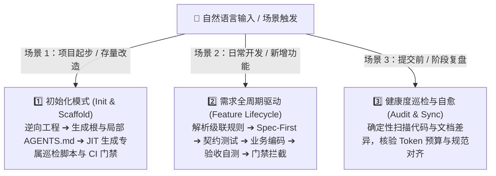

# 🤖 Agentic Doc System Maintainer (Skill)

> 🚀 **面向 AI Agent（Open-SWE / Antigravity / Cursor / Claude Code / Cline）的工程化核心文档体系、Open-SWE 级联规范注入与 ATDD 闭环生命周期管家。**

[](LICENSE)
[](https://github.com/langchain-ai/open-swe)
[](.github/workflows/ci.yml)
[](https://github.com)
[](https://github.com)

---

## 🌟 为什么需要本 Skill？

在 AI 编程（Agentic Coding）时代，开发效率提升了 10 倍，但**文档腐化、架构被破坏、需求理解漂移**的风险也成倍上升。

传统的文档是“人写给人看”的说明书；而本 Skill 践行 **“规范注入（Context Engineering）”**、**“文档驱动开发（Spec-First）”** 与 **“AI 原生元规格即时生成（Spec-Driven JIT Generation）”** 方法论，让 AI 主动在软件生命周期中维护 **分层级联护栏文档体系** 与 **物理硬门禁**：

```
your-project/
├── .github/workflows/ci.yml                 # 🛡️ CI/CD 物理门禁（流水线自动拦截未对齐变更）
├── .pre-commit-config.yaml                  # 🛡️ Git Pre-commit 本地拦截门禁
├── AGENTS.md                                # 1. 🌐 全局根规则（技术栈、高频命令、全局红线）
├── app/src/
│   ├── main/.../domain/AGENTS.md            # 🎯 领域层专有规则（纯 POJO、禁止 Spring/JPA、禁止 @Setter）
│   ├── main/.../adapter/web/AGENTS.md       # 🎯 Web 适配器规则（DTO 隔离、RFC 7807 统一异常）
│   ├── main/.../adapter/persistence/AGENTS.md # 🎯 持久化规则（Entity 与 Domain 互转、JPA 映射隔离）
│   ├── test/AGENTS.md                       # 🧪 单元测试专属规范（AssertJ, 纯内存, 严禁启动 Spring 上下文）
│   ├── contractTest/AGENTS.md               # 🧪 契约测试专属规范（Groovy DSL, CDC 契约映射约束）
│   └── integrationTest/AGENTS.md            # 🧪 集成测试专属规范（MockMvc, H2 隔离自测）
├── docs/
│   ├── specs/                               # 2. 📋 规格驱动需求说明书 (BDD Given-When-Then)
│   ├── architecture.md                      # 3. 🏛️ 架构设计全景图
│   ├── adr/                                 # 3. 🏛️ 架构决策记录 (ADRs)
│   ├── domain-glossary.md                   # 4. 📖 领域统一语言表与模型拓扑树
│   ├── tasks/                               # 5. 📝 任务细粒度 Checklist 实施记录
│   └── runbook.md                           # 6. 🚀 快速启动与 API 自测排错手册
└── scripts/
    └── audit_doc_health.py                  # ⚡ AI 即时生成（JIT）的毫秒级确定性巡检门禁脚本
```

---

## 💡 AI 时代文档维护的 4 大黄金法则

本 Skill 的所有工作流严格遵循以下四大核心设计哲学：

1. **“同 PR 原则 (Same PR Principle)”**：
   - 严禁代码已合入主干而文档还未更新。代码改动、测试用例与相关 Spec/ADR/Glossary 必须在**同一个 Git Commit / PR** 中同步提交。
2. **“分层级联与规则裁决 (Open-SWE Precedence Hierarchy)”**：
   - 全局规则置于根目录 `AGENTS.md`，模块细粒度规则下沉至各子目录 `AGENTS.md`。
   - **裁决优先级**：`局部子目录 AGENTS.md` > `根目录 AGENTS.md` > `docs/specs/*.md` > `LLM 默认习惯`。
3. **“Token 预算控制 (Keep Rules Lean)”**：
   - 根目录 `AGENTS.md` 控制在 **100 行** 内，局部 `AGENTS.md` 控制在 **50 行** 内。只保留红线规则、命令和核心约定，详细业务逻辑分流到 `docs/specs/` 中按需读取。
4. **“把文档当成 AI 的上下文缓存 (Docs as External Memory)”**：
   - 遇到复杂大任务时，主动让 AI 把分析结论、步骤清单写进 `docs/tasks/`。这样即便会话中断、切换分支或新建会话，新 AI 只需要读这个文档就能 **100% 恢复上下文并断点续传**。

---

## ⚡ 三大核心工作模式



1. **`mode: init`（一键脚手架与 JIT 门禁生成）**：
   - 自动扫描现有项目的语言、依赖、分层架构风格，一键生成根目录 `AGENTS.md`、关键子目录分层 `AGENTS.md`、`architecture.md`、`domain-glossary.md` 等基线文档；
   - 根据 `templates/audit_script_spec.md` 规格，**AI 自动为该项目技术栈编写专属的 `scripts/audit_doc_health.py` 巡检脚本**，并配置好 CI / Pre-commit 物理门禁。
2. **`mode: feature`（Spec-First & ATDD 需求驱动）**：
   - 自动解析目标路径的祖先 `AGENTS.md` 级联约束；
   - 需求开发前，AI 必须先出 BDD 格式的 Spec 并等待人类确认；
   - 依据 Spec 先写测试（Red 🔴），再写业务实现（Green 🟢）；
   - 自动在 `docs/tasks/` 打勾并同步 `docs/runbook.md` 中的自测脚本；
   - 执行 `audit_doc_health.py --strict` 确保 100% 物理通过。
3. **`mode: audit`（自动化巡检与自愈）**：
   - 运行内置 Python 扫描脚本，精准比对 Controller API、Domain 实体、Root/Scoped `AGENTS.md` 规范与 Token 预算对齐度，自动修复遗漏。

---

## 🛡️ 物理硬门禁集成指南 (Physical Guardrails)

通过确定性脚本阻断未合规提交，无需消耗额外 Token：

### 1. 本地拦截：Git Pre-commit Hook
在项目根目录 `.pre-commit-config.yaml` 中配置：
```yaml
repos:
  - repo: local
    hooks:
      - id: doc-system-audit
        name: AI 核心文档与代码一致性巡检门禁
        entry: python3 doc-system-maintainer/scripts/audit_doc_health.py --strict
        language: system
        pass_filenames: false
        stages: [commit]
```
> 启用命令：`pip install pre-commit && pre-commit install`

### 2. 构建门禁：Gradle Task 集成
在 `app/build.gradle.kts` 中绑定到 `./gradlew check`：
```kotlin
tasks.register<Exec>("auditDocs") {
    group = "verification"
    description = "AI 核心文档体系与代码一致性巡检门禁"
    workingDir = rootDir
    commandLine("python3", "${rootDir}/doc-system-maintainer/scripts/audit_doc_health.py", "--strict")
}

tasks.named("check") {
    dependsOn(tasks.named("auditDocs"))
}
```

### 3. 流水线门禁：GitHub Actions CI
在 `.github/workflows/ci.yml` 中运行：
```yaml
- name: Run Doc Health Audit Gate
  run: python3 doc-system-maintainer/scripts/audit_doc_health.py --strict
```

---

## 📦 技能包目录结构

```
doc-system-maintainer/
├── SKILL.md                          # 🧠 大脑指挥中心：YAML 元数据 + SOP 状态机
├── templates/                        # 📐 核心文档与脚本的标准生成规格 (Meta-Specs)
│   ├── agents.root.md.tpl           #     - Open-SWE 全局根目录规范模版
│   ├── agents.scoped.md.tpl         #     - Open-SWE 业务分层局部规范模版
│   ├── agents.test.md.tpl           #     - Open-SWE 测试套件专属规范模版 (单测/契约/集成)
│   ├── audit_script_spec.md         #     - AI-Native 巡检脚本生成契约规格
│   ├── spec.md.tpl                  #     - BDD (Given-When-Then) 规格模版
│   ├── adr.md.tpl                   #     - 架构决策记录模版
│   ├── domain-glossary.md.tpl       #     - 领域统一语言模版
│   ├── task.md.tpl                  #     - 任务细粒度 Checklist 模版
│   └── runbook.md.tpl               #     - 运行排错手册模版
├── scripts/                         # 🛠️ 确定性自动化巡检工具
│   └── audit_doc_health.py          #     - 代码、规范与文档对齐度扫描脚本
├── examples/                        # 🌟 Few-Shot 实战参考样例
│   └── sample_spec.md               #     - 标准 BDD 范式样例
└── references/                      # 📚 架构与方法论知识库
    └── methodology_guide.md         #     - 六边形架构 + ATDD + Open-SWE 规范注入指南
```

---

## 📥 安装与使用指南

### 1. 安装到您的 AI 编程助手

#### 选项 A：作为项目级 Skill（推荐，随 Git 共享给团队）
将本仓库克隆或复制到您的项目根目录中：
```bash
git clone https://github.com/DRX-1877/doc-system-maintainer-skill.git .gemini/skills/doc-system-maintainer
```

#### 选项 B：作为全局 Skill
放入您的全局 Agent 技能配置目录：
```bash
git clone https://github.com/DRX-1877/doc-system-maintainer-skill.git ~/.gemini/skills/doc-system-maintainer
```

---

### 2. 触发与日常使用

安装后，您只需要在对话框中**正常用自然语言提问**，AI 将自动命中并执行：

- **初始化新项目**：
  > *“帮我为这个项目初始化 AI 核心文档体系与 CI 门禁”*
- **开发新需求（触发 Spec-First & ATDD）**：
  > *“帮我新增‘取消订单’功能”*
- **检查文档与代码一致性**：
  > *“检查一下当前项目的文档和代码是否一致”*

---

## 📄 开源许可证

本项目基于 [MIT License](LICENSE) 协议开源。欢迎 Star ⭐️ 与提交 PR 贡献！
