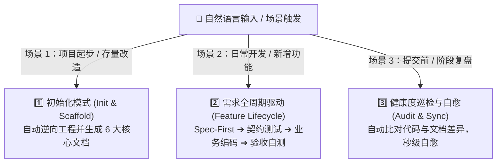

# 🤖 Agentic Doc System Maintainer (Skill)

> 🚀 **面向 AI Agent（Antigravity / Cursor / Claude Code / Cline）的工程化核心文档与 ATDD 闭环生命周期管家。**

[](LICENSE)
[](https://github.com)
[](https://github.com)

---

## 🌟 为什么需要本 Skill？

在 AI 编程（Agentic Coding）时代，开发效率提升了 10 倍，但**文档腐化、架构被破坏、需求理解漂移**的风险也成倍上升。

传统的文档是“人写给人看”的说明书；而本 Skill 践行 **“文档驱动开发（Spec-First）”** 与 **“文档即代码（Docs as Code）”** 的 AI 编程方法论，让 AI 主动在软件生命周期中维护 **6 大核心护栏文档**：

```
your-project/
├── AGENTS.md                                # 1. 🤖 AI 全局指引与硬性约束（技术栈、高频命令、架构红线）
└── docs/
    ├── specs/                               # 2. 📋 规格驱动需求说明书 (BDD Given-When-Then)
    ├── architecture.md                      # 3. 🏛️ 架构设计全景图
    ├── adr/                                 # 3. 🏛️ 架构决策记录 (ADRs)
    ├── domain-glossary.md                   # 4. 📖 领域统一语言表 (DDD 实体、值对象、状态机)
    ├── tasks/                               # 5. 📝 任务细粒度 Checklist 实施记录
    └── runbook.md                           # 6. 🚀 快速启动与 API 自测排错手册
```

---

## ⚡ 三大核心工作模式



1. **`mode: init`（一键脚手架）**：
   - 自动扫描现有项目的语言、依赖、分层架构风格，一键生成 `AGENTS.md`、`architecture.md`、`domain-glossary.md` 等基线文档。
2. **`mode: feature`（Spec-First & ATDD 需求驱动）**：
   - 需求开发前，AI 必须先出 BDD 格式的 Spec 并等待人类确认；
   - 依据 Spec 先写测试（Red 🔴），再写业务实现（Green 🟢）；
   - 自动在 `docs/tasks/` 打勾并同步 `docs/runbook.md` 中的自测脚本。
3. **`mode: audit`（自动化巡检与自愈）**：
   - 运行内置 Python 扫描脚本，精准比对 Controller API、Domain 实体与文档的对齐度，自动修复遗漏。

---

## 📦 技能包目录结构

```
doc-system-maintainer/
├── SKILL.md                          # 🧠 大脑指挥中心：YAML 元数据 + SOP 状态机
├── templates/                        # 📐 6 大核心文档的标准脚手架模版
│   ├── spec.md.tpl                  #     - BDD (Given-When-Then) 规格模版
│   ├── adr.md.tpl                   #     - 架构决策记录模版
│   ├── domain-glossary.md.tpl       #     - 领域统一语言模版
│   ├── task.md.tpl                  #     - 任务细粒度 Checklist 模版
│   └── runbook.md.tpl               #     - 运行排错手册模版
├── scripts/                         # 🛠️ 确定性自动化巡检工具
│   └── audit_doc_health.py          #     - 代码与文档对齐度扫描脚本
├── examples/                        # 🌟 Few-Shot 实战参考样例
│   └── sample_spec.md               #     - 标准 BDD 范式样例
└── references/                      # 📚 架构与方法论知识库
    └── methodology_guide.md         #     - 六边形架构 + ATDD 规则指南
```

---

## 📥 安装与使用指南

### 1. 安装到您的 AI 编程助手

#### 选项 A：作为项目级 Skill（推荐，随 Git 共享给团队）
将本仓库克隆或复制到您的项目根目录中：
```bash
git clone https://github.com/DRX-1877/doc-system-maintainer-skill.git .gemini/skills/doc-system-maintainer
```

#### 选项 B：作为全局 Skill
放入您的全局 Agent 技能配置目录：
```bash
git clone https://github.com/DRX-1877/doc-system-maintainer-skill.git ~/.gemini/skills/doc-system-maintainer
```

---

### 2. 触发与日常使用

安装后，您只需要在对话框中**正常用自然语言提问**，AI 将自动命中并执行：

- **初始化新项目**：
  > *“帮我为这个项目初始化 AI 核心文档体系”*
- **开发新需求（触发 Spec-First & ATDD）**：
  > *“帮我新增‘取消订单’功能”*
- **检查文档与代码一致性**：
  > *“检查一下当前项目的文档和代码是否一致”*

---

## 📄 开源许可证

本项目基于 [MIT License](LICENSE) 协议开源。欢迎 Star ⭐️ 与提交 PR 贡献！
