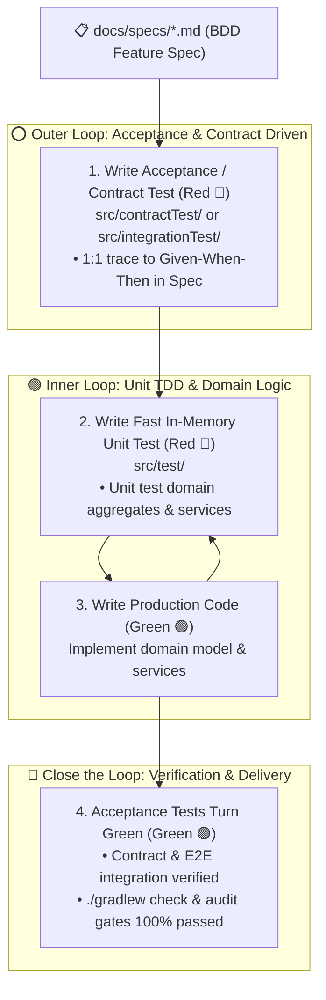

# Engineering Methodology Guide: Architecture-Agnostic Context Engineering & Double-Loop ATDD

---

## 🏛️ 1. Architecture Pattern Recognition & Subsystem Mapping

AI agents must dynamically recognize the project's actual architectural paradigm upon onboarding, rather than blindly applying dogmatic concepts:

| Architecture Paradigm | Core Directory & Layer Layout | Core Model Concept | Recommended Scoped `AGENTS.md` |
| :--- | :--- | :--- | :--- |
| **DDD Hexagonal / Clean** | `domain/` (Core), `application/` (Use Cases), `adapter/web/`, `adapter/persistence/` | Aggregate Roots, Entities, Value Objects | `domain/`, `adapter/web/`, `adapter/persistence/` |
| **Traditional MVC / 3-Tier** | `controller/`, `service/`, `dao/` or `repository/`, `entity/` | Database Entities, DTOs, Enums | `controller/`, `service/`, `dao/` |
| **FastAPI / Schema-Driven** | `routers/`, `models/` (ORM), `schemas/` (Pydantic), `services/` | ORM Table Models, Pydantic Schemas | `routers/`, `models/` |
| **Go Clean / Modular** | `cmd/`, `internal/domain/`, `internal/usecase/`, `internal/repository/` | Domain Structs, Port Interfaces | `internal/domain/`, `internal/repository/` |

---

## 🧪 2. Test Tiering & Testing Context Engineering

Testing code and production business code have fundamentally different concerns. By establishing dedicated `AGENTS.md` rules for distinct test suites, we eliminate prompt pollution while maintaining strict testing quality:

| Test Suite Tier | Typical Paths | Role & Core Purpose | Hard Red Lines |
| :--- | :--- | :--- | :--- |
| **Unit Tests (Inner Loop)** | `src/test/`, `tests/unit/` | Pure in-memory execution (< 50ms), testing domain entities and pure business calculations | **Strictly forbid booting containers or heavy Spring Contexts**; prefer real domain instances over excessive mockito; enforce AssertJ / pytest assertions. |
| **Contract Tests (Outer Loop)** | `src/contractTest/` | Consumer-Driven Contracts (CDC), ensuring 100% compliance between API code and specifications | Written in Groovy / Pact DSL; 1:1 trace to `docs/specs/`; standardized BaseClass inheritance. |
| **Integration Tests (Outer Loop)** | `src/integrationTest/`, `tests/integration/` | Validating multi-component assembly, web routing, and database transactions | Use MockMvc / TestClient / In-memory DBs; strictly isolate from physical external networks. |

---

## 🔄 3. Double-Loop ATDD Workflow (Acceptance Test-Driven Development)

---

## 🧠 4. Open-SWE Hierarchical Context Engineering

### 4.1 Precedence Resolution Order
1. **[Highest Precedence]** Subdirectory Scoped `AGENTS.md` (e.g., `domain/AGENTS.md`, `src/test/AGENTS.md`)
2. **[Second Precedence]** Repository Root `AGENTS.md`
3. **[Business Precedence]** `docs/specs/*.md` feature specification documents
4. **[Lowest Precedence]** The LLM's own general defaults and statistical biases

### 4.2 Token Budget Optimization
- **Root `AGENTS.md`**: Kept within **100 lines**, strictly for high-frequency commands, runtime versions, and global non-negotiable boundaries.
- **Scoped/Test `AGENTS.md`**: Kept within **50 lines**, focused exclusively on layer dependencies and assertion conventions.
- **Dynamic Business Rules**: Never written into `AGENTS.md`; always documented in `docs/specs/` and loaded on demand.
